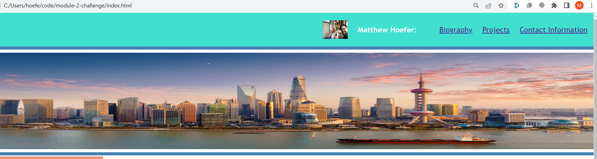

# module-2-challenge

Github repository https://github.com/hoeferm2/module-2-challenge
Deploy Site 
## Your Task

The task presented to me for moduele 2 was to create a portfolio from scratch, additionally the page should be able to work on multiple screen sizes through flex boxes.

## User Story

## Navigation
The employer asked for a website with the developers name, a recent photo and links to the sections about them their work and how to contact. Provided below is a linked image showing the the initial navigation bar. 

This navigation header includes a photo of the developer, the developer name and three working links to sections in the document (biography,projects,contact-info).

## main

This section includes two main sections the biography and project list. The biography consists of a title and a paragraph element.

The project section has 4 cards each representing a project. Hovering over each of them will change the opacity. I was unable to make a larger flex box. 

## footer

Links are provided each of them can link to an external website. The phone numberr is not currently linked.